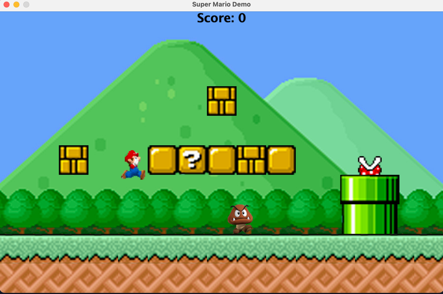
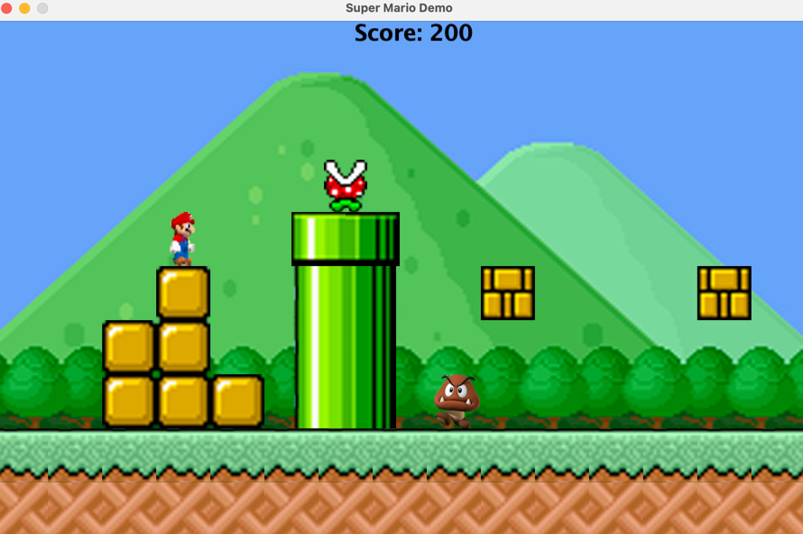
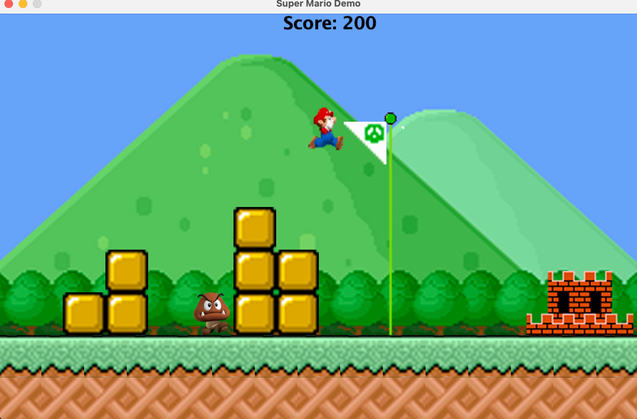

# Super Mario Game Demo

## Overview
This is a game demo which realized the basic game play of Super Mario game.
The player can control Mario forward, backward and jump. There are moving enemies and unmoved blocks on the stage. Enemies can 
be eliminated by treading onto them. Bricks can be eliminated by jump and hit. At the end, Mario needs to jump 
to pull off the flag form the pole to clear the stage. The score is displayed on the screen.

## Coding Language
* JAVA

## Screenshots

